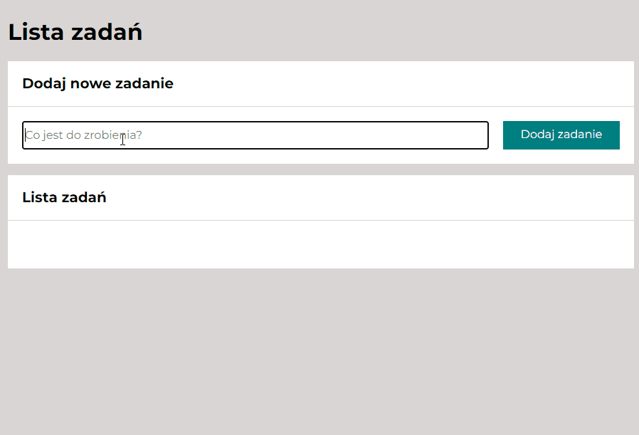

# Task list

## Demo
https://q270311.github.io/task-list/
## Description 
Project implemented during the _Frontend Developer od podstaw_ course at the **YouCode** -  online programming school.

The web application allows you, to save tasks to be done soon on the board. They can also be words to be learned in another language for example.
The green button allows you to mark the task as completed.
Each of the tasks can be removed from the board at any time by clicking the trash can icon.

## Languages
 - HTML
 - CSS
 - BEM
 - Flex, Grid
 - JavaScript
 - ES6+ features